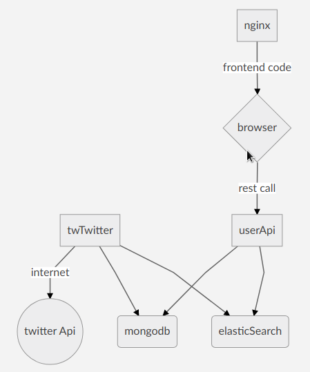

# Twitter challenge

## Start the app

### Requirements
- docker and docker-compose installed and working
- [create a twitter app](https://apps.twitter.com/)


### Steps
- Clone this repository
- Enter the project folder
- Edit twFetcher/src/config.ts 
  - set your twitter api keys
  - customize 'twitter.search.query' value, default is '#blockchain'
- Launch docker-compose (as root)
- Open a browser and digit http://localhost:8080 

Command recap
```bash
git clone https://github.com/bogomips/twitter-challenge
cd twitter-challenge
gedit twFetcher/src/config.ts
sudo docker-compose up
```
## Design

### Software stack
**twFetcher**: A nodejs app that fetches tweets from twitter api and writes them on **Mongodb and Elasticsearch**
**userApi**: A nodejs app that provides a pubblic api to which the frontend app connects
**frontend**: An ionic3/angular5 app for the final user. It is served from a **Nginx** server



### Details
#### twFetcher
It runs two main "setInterval" cylces.
**The first cycle** periodically queries the twitter api and fetches the last 100 tweets for the key specified in the config.ts file (config.twitter.search.query).
The cycle interval is set as well inside the config.ts file, but a function makes sure that value is not too low for the twitter api limitations.
The **fetchIntervalCalculator** function queries the twitter api to discover the limits and the remaining calls within the "api window" (15m)
In this way, it calculates the maximum admitted interval:
> Math.ceil(1/(remainingQuery/reqWindowMs))+100;

If the set value is lower than the calulated one, it will be overwritten.
The tweets returned from this cycle are stored in the mongo db.
The mongodb collection is "capped" so only 100 tweets remain, the older are automatically eliminated. 
An alternative could be to set the property capped:false in the config.ts file and let mongodb grow.
In this case, the last 100 records have to be read and indexed in elasticsearch.
The collection also has an "unique" index on the "id" field that prevents duplicated tweets to be stored.

**The second cycle** reads the collection from mongodb and indexes these values in the elasticsearch.
This ensure the dbs are always syncronyzed.

A map is provided to the elasticsearch, in order the text field "created_at" (returned by twitter) to be recognize as a date.
```js
created_at: {
	format:  "EEE MMM dd HH:mm:ss Z YYYY",
	type:  "date",
}
```
In this way it becomes possible to **sort the tweets by data**.

#### userApi
This is a simple restful api implemented in nodejs.
The framework is koaJs, written to work well with the async/await construct.
The api is made of two endpoints:

**/search**
Method **GET**
Queries **q:string**
Description: returns the last 100 tweets indexed in elasticsearch, sorted by date.
When the querystring q=key is passed, data are filtered.

**/twitter/tweets/:id***
Method **GET**
Parameters: **id:int**
Description: returns the complete tweet document from mongodb, as it comes from the twitter api.

#### frontend
It's a one page app based on ionic/angular/webpack.
It's made of two pages, one to search tweets and one to display the selected tweet detail.
The api requests are performed through the "apis" provider.
The "highlight" directive highlights the searched phrase, while the "links-render" converts links and twitter ids to a nicely displayed hyper text.


### Other approaches           
In a first design I was using rabbitMq to send messages from twFetcher to another app that was processing and storing tweets in the dbs.
Also, I found many alternative approaches to synchronize the two dbs.
Many of these projects are developed during the spare time or dismissed or they would have added other levels of complexity.
I also evaluated logstash that can automatically fetch and index tweets in elasticsearch, but it is not suitable for keeping the dbs aligned, plus in this way, I would have lost the control of the whole operation.
The approach I've finally chosen does not introduce a performance issue because the tweets are written just on two master node databases.
If scaling is needed, databases will be replicated.

### Scaling strategies
Mongodb and Elasticsearch can be easily replicated for high availability and read performance purposes.
While the elasticsearch db will always contain the last 100 tweets, mongodb (if capped is set to false) can grow.
In this case sharding is a good option.
The userApi can easily be deployed to many servers. Dns round robin or a more sophisticated load balancer can be used to distribute the requests amongst the servers.

### Possible change in the requirements
Several details are easily controllable through config.ts files.
The whole codebase is written in typescript wich is suitable for large projects.
All the projects are structured to be easily expanded and modified.

### Todo
All the projects have support for unit tests. 
Unit tests and e2e tests have to be written in order to avoid regression bugs.
